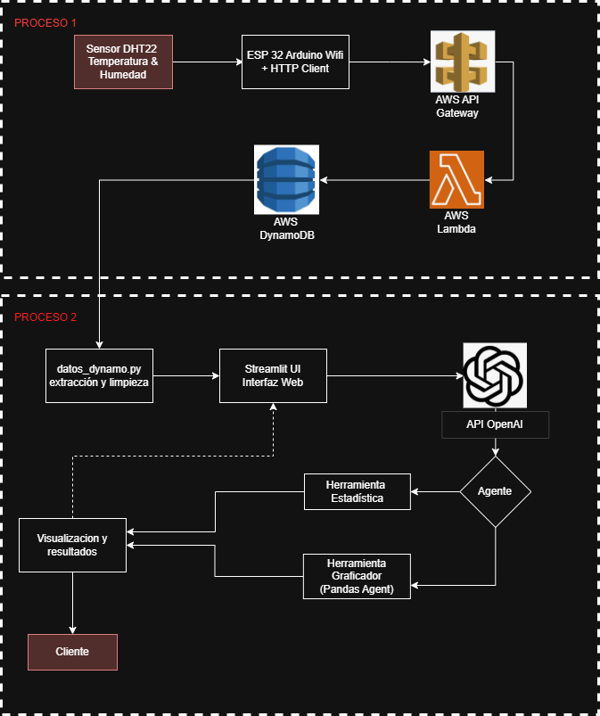
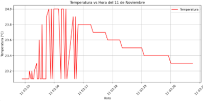
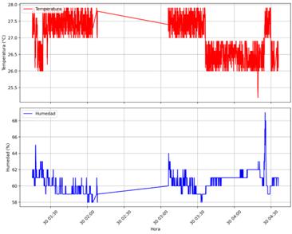
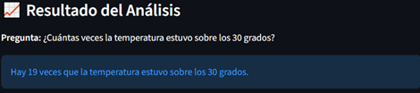

## IoT-LLM Integration: Consulta de Datos Ambientales con Lenguaje Natural

### 🧩 Descripción General

Este proyecto implementa un prototipo **End-to-End** que integra sensores **IoT** con **Modelos de Lenguaje Grande (LLM)** para permitir el monitoreo y análisis de datos ambientales mediante **consultas en lenguaje natural**  
(por ejemplo: *“¿Cuál fue la temperatura máxima ayer?”*).

El sistema **democratiza el acceso a la información técnica**, eliminando la necesidad de que el usuario:

- Interprete dashboards complejos.
- Escriba consultas SQL o código de análisis de datos.

En su lugar, un **agente inteligente** orquesta automáticamente:

- La extracción de datos desde AWS.
- El análisis estadístico.
- La generación de gráficos.
- La entrega de resultados al usuario final en una interfaz web sencilla.

---

## 🏗️ Arquitectura del Sistema

La solución sigue una arquitectura **serverless** desplegada en **AWS**, dividida en dos procesos principales:

### 🔹 Proceso 1 – Captura y Almacenamiento de Datos IoT

- **Capa física (Edge):**
  - **Hardware:** ESP32 con sensor de temperatura y humedad (DHT11/DHT22).
  - **Conectividad:** WiFi.
  - **Protocolo:** MQTT seguro (TLS 1.2) / HTTP según configuración del prototipo.
- **Capa de nube (AWS):**
  - **Ingesta:** `AWS IoT Core` o `AWS API Gateway` como punto de entrada.
  - **Lógica de negocio:** `AWS Lambda` procesa los mensajes y aplica reglas básicas.
  - **Almacenamiento:** `Amazon DynamoDB` como base de datos NoSQL para series de tiempo (temperatura, humedad, timestamp, etc.).

### 🔹 Proceso 2 – Consulta Inteligente y Visualización

- **Extracción y limpieza de datos:**
  - Script `datos_dynamo.py` para leer, limpiar y estructurar los datos desde DynamoDB.
- **Interfaz web:**
  - Aplicación en `Streamlit` que actúa como frontend y backend ligero.
- **Capa de inteligencia (LLM + Agentes):**
  - **Framework de agentes:** `LangChain`.
  - **Modelo de lenguaje:** `OpenAI gpt-4o-mini`.
  - **Agente ReAct:** decide, en función de la consulta del usuario, si debe:
    - Ejecutar análisis estadístico.
    - Generar un gráfico.
    - Producir una explicación en lenguaje natural.
- **Herramientas del agente:**
  - **Herramienta estadística:** operaciones con `pandas` sobre DataFrames (media, máx/mín, desviación estándar, etc.).
  - **Herramienta graficadora:** generación dinámica de gráficos mediante `matplotlib`.
- **Salida al usuario final:**
  - Módulo de **“Visualización y resultados”** que muestra:
    - Texto generado por el LLM.
    - Tablas y métricas.
    - Gráficos de tendencias.
  - Consumido por el **cliente** a través del navegador.

> El diagrama completo del flujo se encuentra en `files/arquitectura.png`.

---

## 🚀 Funcionalidades Principales

- **Consultas en lenguaje natural (español):**  
  El usuario escribe una pregunta del tipo:
  - *“Muéstrame la tendencia de la temperatura de la última semana.”*
  - *“¿Cuál fue la humedad promedio ayer?”*
  - *“Genera un gráfico comparando temperatura y humedad del día de hoy.”*

- **Agente ReAct (Reasoning + Acting):**  
  El agente utiliza el patrón **Zero-shot ReAct** para:
  - Interpretar la intención del usuario.
  - Decidir qué herramienta invocar (estadística o gráfica).
  - Generar pasos de razonamiento intermedios (ocultos al usuario) y ejecutar el código correspondiente.

- **Generación dinámica de gráficos:**
  - El agente **escribe y ejecuta** código `matplotlib` en tiempo real.
  - Soporta gráficos de líneas, barras u otras visualizaciones configuradas en el agente.

- **Análisis estadístico sobre histórico de datos:**
  - Cálculo de métricas con `pandas`:
    - Media, mediana, máximos, mínimos.
    - Desviación estándar.
    - Filtrado por rangos de fecha/hora.
  - Resultados explicados en lenguaje natural por el LLM.

- **Interfaz web simple para el usuario final:**
  - Implementada con `Streamlit`.
  - Campo de texto para la consulta + área de resultados (texto + estadísticas + gráfico si aplica).
  - No requiere conocimientos de programación ni de AWS.

---

## 🛠️ Stack Tecnológico

- **Dispositivo IoT / Firmware**
  - Lenguaje: **C++** (Arduino IDE / PlatformIO).
  - Hardware: **ESP32** + sensor **DHT11/DHT22**.

- **Backend / Aplicación**
  - Lenguaje principal: **Python 3.9+**.
  - Framework web: **Streamlit**.

- **IA y Agentes**
  - **LangChain** (orquestación del agente y herramientas).
  - **OpenAI API** (`OpenAI gpt-4o-mini` como LLM principal).

- **Procesamiento y datos**
  - **pandas** para manejo de DataFrames.
  - **matplotlib** para visualización.
  - **boto3** para comunicación con servicios AWS.
  - **DynamoDB** como almacenamiento NoSQL.

- **Infraestructura en la nube**
  - `AWS IoT Core` o `API Gateway` para recepción de datos.
  - `AWS Lambda` para procesamiento serverless.
  - `Amazon DynamoDB` para almacenamiento de registros de temperatura/humedad.

---

## 📂 Estructura del Repositorio

*(Ejemplo, ajusta según tu implementación real)*

```
├── datos_dynamo.py         # Extracción y limpieza de datos desde DynamoDB
├── lang.py                 # Definición del agente, herramientas y llamadas al LLM
├── app.py        # Interfaz web principal (entrada de texto y visualización)
├── files/
│   └── arquitectura.png    # Diagrama general del sistema
└── README.md               # Este archivo---
```
---

## 🧪 Ejemplos de Consultas y resultados

- *Dame un gráfico de la temperatura vs hora del 11 de noviembre*

- *Dame un gráfico de la temperatura y humedad vs hora del 30 de noviembre*

- *¿Cuántas veces la temperatura estuvo sobre los 30 grados?* 


---
## 📌 Estado del Proyecto y Trabajo Futuro

- **Estado actual:** Prototipo funcional orientado a validación académica / de investigación.
- **Mejoras futuras:**
  - Añadir autenticación de usuarios.
  - Extender a múltiples sensores y ubicaciones.
  - Incorporar otros modelos (ej. GPT-4 u open-source) y técnicas de RAG.
  - Uso de MCP para el conocimiento de la base de datos.

---
